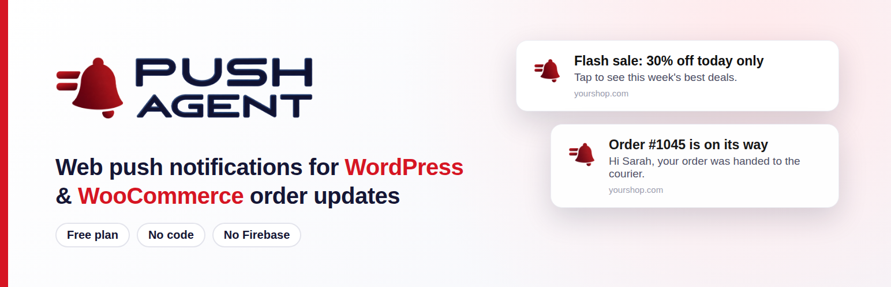
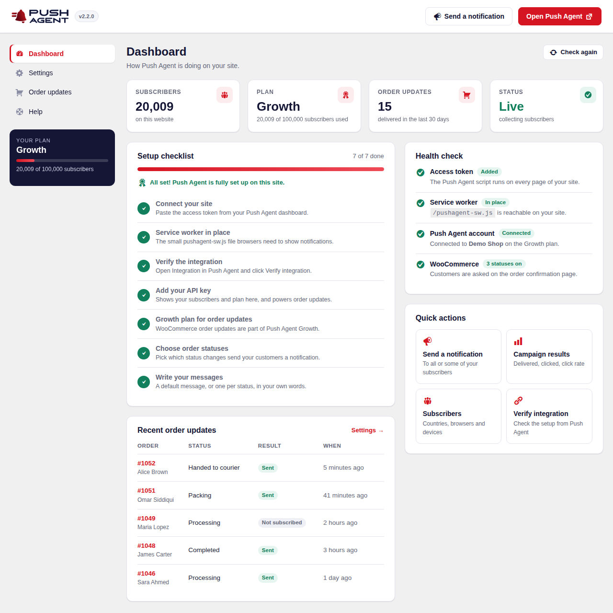
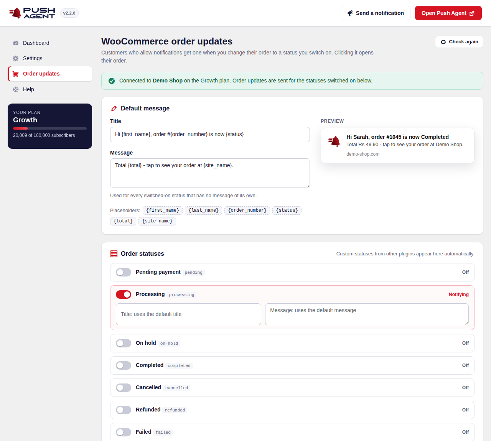
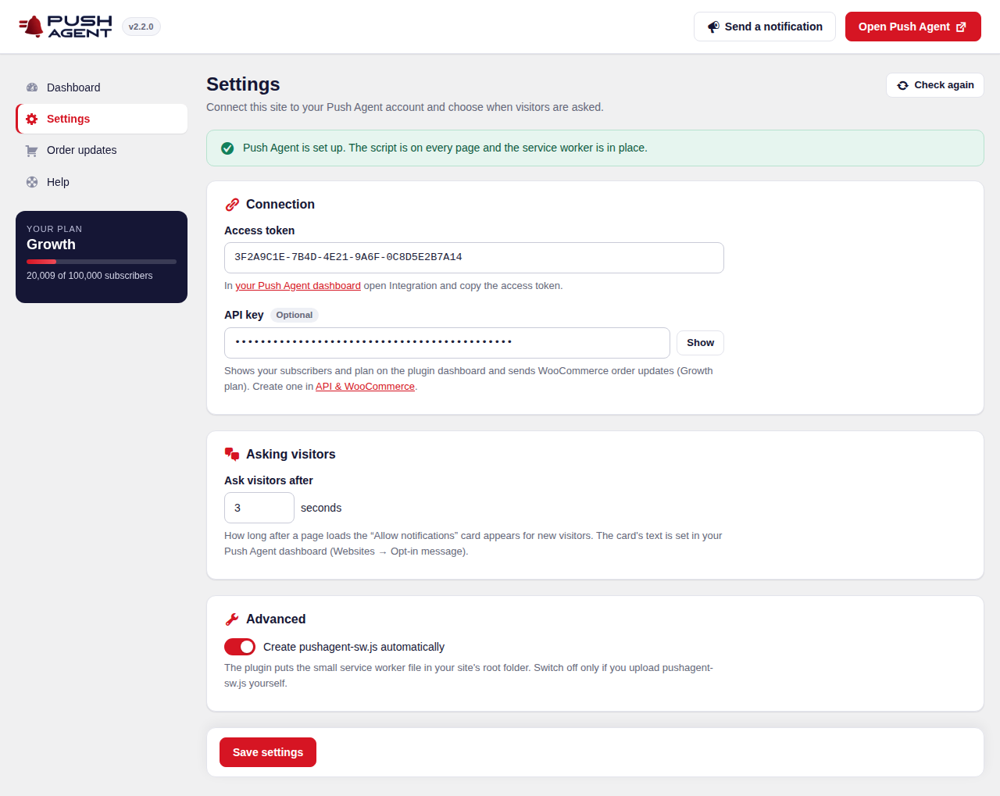
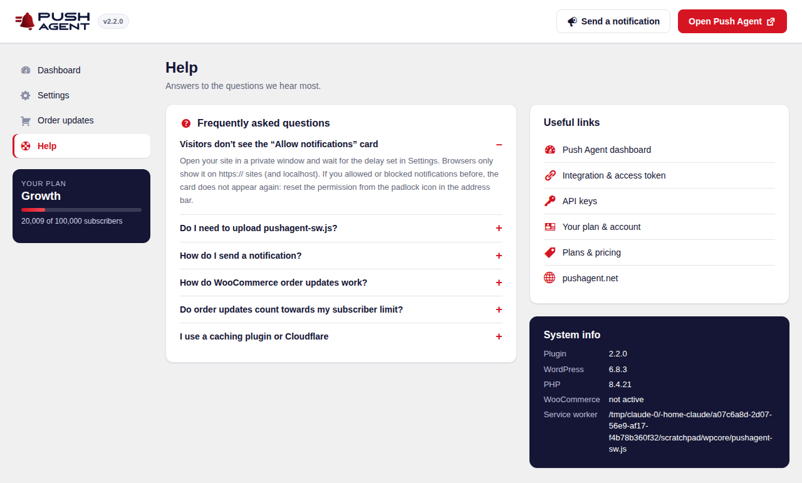

  

# Push Agent for WordPress

**Free web push notifications for WordPress, plus WooCommerce order-status notifications for your customers.**
Standard Web Push: no Firebase project and no Google account needed.

[Website](https://pushagent.net) · [Install on WordPress (guide)](https://pushagent.net/docs/install-on-wordpress/) · [WooCommerce order notifications (guide)](https://pushagent.net/docs/set-up-woocommerce-order-notifications/) · [WordPress.org plugin page](https://wordpress.org/plugins/push-agent/) · [Pricing](https://pushagent.net/pricing/)

---

## Features

**Web push notifications**
- Adds the Push Agent script to every page — no code to paste.
- Creates the `pushagent-sw.js` service worker in your site's root folder automatically, and serves it through WordPress if the folder isn't writable.
- A friendly "Allow notifications" card for new visitors, shown after the delay you choose.
- Send to everyone or target by country, device and browser, and schedule notifications from your [Push Agent dashboard](https://app.pushagent.net).
- Works in Chrome, Edge, Firefox, Opera, Samsung Internet and Safari.

**WooCommerce order updates** (Push Agent Growth plan)
- Notify customers when their order status changes, including custom statuses added by other plugins.
- Your own message per status, with placeholders such as `{first_name}`, `{order_number}`, `{status}` and `{total}`, and a live preview.
- A "Get updates about this order" box on the order confirmation page.
- Every send is recorded as an order note.
- Customers are matched with a one-way code made from their email and your API key. The email itself is never sent to Push Agent.
- Compatible with High-Performance Order Storage (HPOS).

**A dashboard inside WordPress**
- Subscribers, plan and order updates at a glance, plus a setup checklist and a health check.

## Requirements

- WordPress 4.7 or newer, PHP 5.6 or newer
- WooCommerce 3.0 or newer (only for order updates)
- An HTTPS website (browsers only allow push on secure sites; `localhost` works for testing)
- A free Push Agent account at [app.pushagent.net](https://app.pushagent.net)

## Installation

**From WordPress (recommended):** go to **Plugins → Add New Plugin**, search for **Push Agent**, then click **Install Now** and **Activate**.

**From GitHub:** download the latest `.zip` from [Releases](../../releases) and upload it under **Plugins → Add New Plugin → Upload Plugin**.

Then:
1. Sign in at [app.pushagent.net](https://app.pushagent.net) (free) and add your website.
2. Open **Integration** and copy your **access token**.
3. In WordPress, open **Push Agent → Settings**, paste the token and click **Save settings**.
4. Back in your Push Agent dashboard, click **Verify integration**.

The full step-by-step guide with screenshots is at **[pushagent.net/docs/install-on-wordpress](https://pushagent.net/docs/install-on-wordpress/)**.

### WooCommerce order updates
1. In your Push Agent dashboard, open **API & WooCommerce** and create an API key.
2. In WordPress, paste it under **Push Agent → Settings**.
3. Open **Push Agent → Order updates**, switch on the statuses you want and write your messages.

See [Set up WooCommerce order notifications](https://pushagent.net/docs/set-up-woocommerce-order-notifications/).

## Screenshots

| Dashboard | Order updates |
|---|---|
|  |  |
| **Settings** | **Help** |
|  |  |

## External service

This plugin connects to the Push Agent service at [app.pushagent.net](https://app.pushagent.net), run by the makers of this plugin, to store subscriptions and deliver notifications. What is sent, and when, is described in [`readme.txt`](readme.txt) under *External service*, and in our [privacy policy](https://pushagent.net/privacy-policy/).

## Changelog

See the *Changelog* section of [`readme.txt`](readme.txt).

## Support

- Documentation: [pushagent.net/docs](https://pushagent.net/docs/)
- Questions and help: [pushagent.net/support](https://pushagent.net/support/)
- Bugs: [open an issue](../../issues)

## Licence

GPL-2.0-or-later. See [LICENSE](LICENSE).
